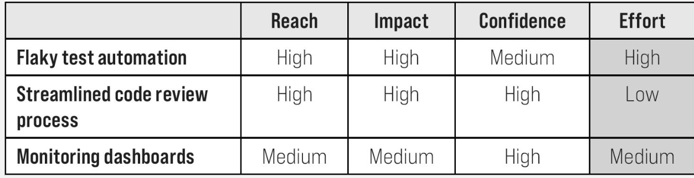
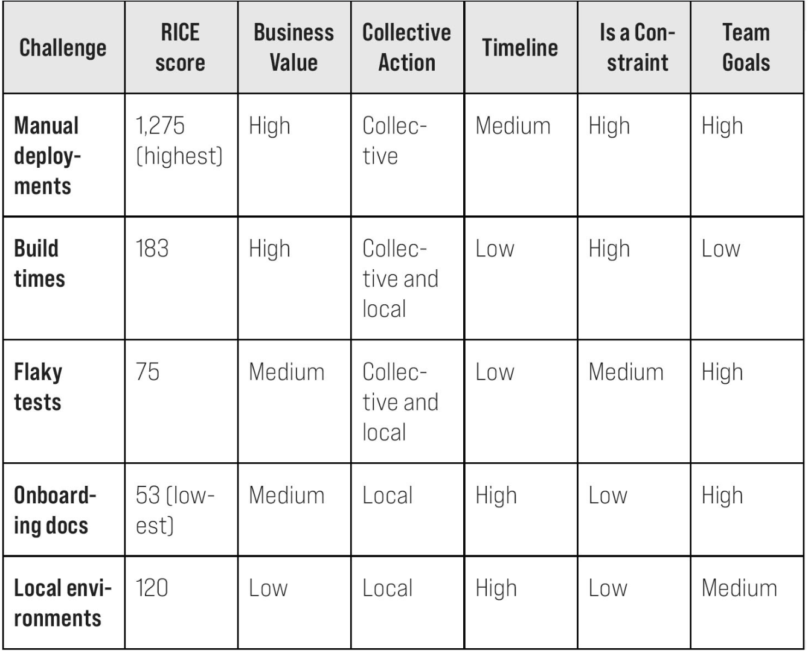

<!-- backgroundImage: "linear-gradient(
    135deg,
    #F5E9FA 0%,
    #E9D4F2 40%,
    #DCC0EA 70%,
    #CFAAE2 100%

    
)" -->
# Frictionless
7 Passos para remover barreiras, desbloquear valor e ultrapassar os competidores na era da IA

---

# Sobre mim

engenheiro da computação POLI-USP
<a href="https://www.youtube.com/500pianosongs">pianista clássico</a>
filósofo de boteco
budista
acionista da Vivo

---

# Sobre nós

- Resolve logo o que faz diferença para o cliente <i class="fa fa-check"></i>
- Tem postura construtiva, colabora e confia nas conexões <i class="fa fa-check"></i>
- Age com coragem, testa novas idéias e aprende com cada descoberta <i class="fa fa-check"></i>
- Vai direto ao ponto, resolve com quem importa e simplifica o caminho <i class="fa fa-check"></i>
- Assume a responsabilidade por suas ações e resultado, reconhecendo que omissões também geram impacto <i class="fa fa-check"></i>

---
# Passo 1: Entendendo DevEx

A experiência do desenvolvedor é um investimento voltado para a melhoria da eficácia da engenharia de software.

É um ciclo virtuoso: ao reduzir o **ATRITO** e o desperdício no trabalho diário dos desenvolvedores, eles conseguem entregar software de alta qualidade mais rapidamente, além de aumentar a satisfação e o engajamento.

---
# Por que o DevEx importa?

A **aceleração** trazida pela IA faz o **ATRITO** ficar ainda mais caro

- Caso Knight Capital: **atritos** demais levaram à implantação com más-práticas e US$460 mi de prejuízo
- Caso SaaStr.AI: delete do banco de dados via agente de IA.

---
# Não é sobre aumento de produtividade?

- Produtividade cria pavor, "Experiência" abre porta para o diálogo.

- <a href="https://en.wikipedia.org/wiki/Goodhart%27s_law">Goodhart´s Law</a>: quando a métrica é o objetivo, ele deixa de ser uma boa métrica.

---
# Os 3 pilares

1. Feedback loop
    - Esperar por 15~30 minutos por build/teste leva a troca de contexto e perda de 15~30% do tempo produtivo do desenvolvedor.
1. Flow State
    - Foco mental para atividades complexas, debug
1. Carga Cognitiva
    - Falta de documentação
    - Sistemas fragmentados
    - Toil: c0rn0-job
    - IA é uma faca de 2 gumes

---
# Os sintomas de um DevEx ruim

- Para o negócio: demora do time-to-market
- Para líderes: tempo de entrega indefinido, planejamento dificultado e retenção de talentos
- Para times: Muitas reuniões para coordenar WAs, troca de contexto mental e diminuição da colaboração.

---
# Traduzindo DevEx em valor de negócio

- Fale sobre o desperdício de tempo durante o tempo de build/teste
- Cada ponto no DXI (DevEx Index) traduz em 13 minutos de economia/semana.

---
# Melhorando o DevEx

- Entreviste 15 desenvolvedores respeitando o tempo deles (~30min)
- Categorize os temas: "tempo de setup", "confusão processual","falta de documentação"
- Visualize o workflow, ferramentas e atrito. Considere diagramas.
- Entenda os stakeholders para uma boa comunicação e controle de expectativas
    - Utilize o teste do veto (SVPG)
- Compartilhe o que aprendeu

---
# Comece pequeno com um quick-win

Escolha o projeto certo com o RICE:
- **R**each (alcance): quantos desenvolvedores são afetados?
- **I**mpacto: Os desenvolvedores notarão a mudança?
- **C**erteza: você consegue entregar com sucesso?
- **E**sforço: Quão rápido você consegue mostrar?
---
# Exercicio RICE

---
# Compartilhe early-wins para ganhar tração

- Fail-fast e compartilhe os aprendizados <i class="fa fa-check"></i>
- Celebre os ganhos <i class="fa fa-check"></i>
- Traga outros para a jornada <i class="fa fa-check"></i>
- Compartilhe os achados ponderadamente: públicos distintos "vibram" com diferentes tipos de comunicação e níveis de detalhe.
---
# As armadilhas comuns
- Não fique na defensiva durante feedback
- Receba críticas
- Não confie demais ao prescrever soluções
- Balanceie conhecimento com curiosidade
- Colabore
- Confie e empodere as equipes
- Invista em compartilhamento de contexto e decisões

---
# Use dados para otimizar o DevEx
- Pesquisas brilham em identificar atritos escondidos
- Dados sistêmicos (logs, tempos de build,etc) brilham em quantificar o estado atual

---
# Exemplo de pesquisa
1. **Qual o seu nível de satisfação com seu conjunto de ferramentas atual?** (Avalie em uma escala de satisfação de 5 pontos.) 
1. **Selecione as três principais barreiras à sua produtividade**. (Forneça uma lista do seu fluxo de trabalho mapeado, com a possibilidade de adicionar outras ferramentas que você possa ter esquecido.) 
1. **Com que frequência cada item selecionado bloqueia seu trabalho?** (Repita os itens selecionados e ofereça as opções: a cada hora, diariamente, semanalmente, mensalmente, com menos frequência que mensalmente.) 
1. **Compartilhe outras ideias ou informações que você gostaria que a equipe de DevEx soubesse.** Você pode incluir este lembrete: Por favor, não compartilhe nenhuma informação confidencial ou que possa identificar você.

---
# Medição de valor

Aplique o teste Sean Ellis:

Como você se sentiria se não pudesse mais usar [sua plataforma/ferramenta]?  
- Muito decepcionado(a). 
- Um pouco decepcionado(a). 
- Não decepcionado(a)

Produtos consagrados devem ter pelo menos **40%** de resposta "Muito decepcionado"

---
# Invista em dados sistêmicos

- Comece com 80% de pesquisas e 20% de dados sistêmicos.
- Evite a fadiga de pesquisas (15min max a cada 3~6 meses)

---
# Invista em dados sistêmicos

- Comece com 80% de pesquisas e 20% de dados sistêmicos.
- Evite a fadiga de pesquisas (15min max a cada 3~6 meses)

---
# Como a IA afeta os dados que você precisa?

Uma vez que a IA entra no workflow de desenvolvimento considere:
- Comparar o tempo de análise de PR com/sem IA
- Medir qualidade (taxa de aceitação de PRs)
- Monitorar a adoção de IA (quais times estão usando ferramentas de IA efetivamente?)
- Avaliar a diferença de complexidade (a IA está sendo utilizada diferentemente para tarefas simples e complexas?)

---
# Tornando os dados acionáveis

Tempos de execução dos conjuntos de testes com mediana de 5 minutos, mas média de 12 minutos → Investigar testes "flaky" ​​ou contenção de recursos.

LinkedIn mostra apenas os dados necessários: os valores atuais e o que mudou.

---
# Tornando os dados acionáveis

Tempos de execução dos conjuntos de testes com mediana de 5 minutos, mas média de 12 minutos → Investigar testes "flaky" ​​ou contenção de recursos.

LinkedIn mostra apenas os dados necessários: os valores atuais e o que mudou.

Às vezes é necessário fazer parceria com "Cientista de Dados"

---
# Foque os esforços DevEx

Utilize o RICE.

"As pessoas pensam que foco significa dizer sim àquilo em que você precisa se concentrar. Mas não é nada disso. Significa dizer não às outras centenas de boas ideias que existem. Você precisa escolher com cuidado. Na verdade, tenho tanto orgulho das coisas que não fizemos quanto das que fizemos. Inovação é dizer não a mil coisas." - Steve Jobs

---
# Assesment Cloudtech

---
# Venda a estratégia para os stakeholders